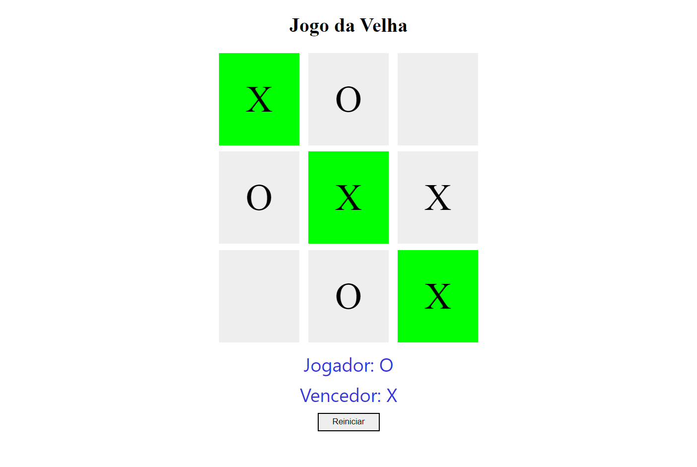

# Projeto Jogo da Velha

> Plataforma Digital Innovation One

 Projeto realizado no Bootcamp Javascript Game Developer - DIO, foi recriado o jogo da velha, utilizando HTML5, CSS3 e Javascript para realizar as interações. 
 
 Desenvolvido 21/12/21.

[ 📎 Clique aqui para acessar] ()

 ## Tecnologias 🖥️ 🚀 

- HTML
- CSS
- Javascript
- Git e GitHub

